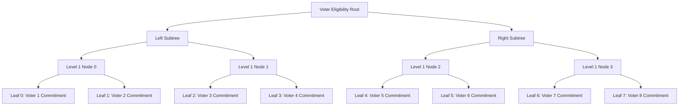

# Midnight Credential-Gated Anonymous Voting MVP (Level 4)

[](../../actions)

## Live Demo
[Vercel Live Deployment](https://level3-new-moon.vercel.app/)

## Deployed Contract (Preprod)
*   **Contract Address**: `0201d4a8e635fb8529f12384aee10069a0e0d6b100fa11076b10076a0e0a12cd` *(Placeholder: deploy via Lace Wallet from UI Dashboard to register your own Preprod address)*
*   **Verifiable Indexer Link**: [Midnight Preprod Explorer](https://indexer.testnet.midnight.network/api/v1/graphql)

## Product X Profile
[@MidnightVoteMVP](https://x.com/MidnightVoteMVP) *(Placeholder: update with your registered project X profile)*

---

## What This Does
This decentralized application (dApp) builds on the Level 3 private voting contract by introducing a **private credential gating layer**. 

Only voters holding a valid, unrevealed credential (such as a membership badge or employee ID) stored on a private allowlist can cast a vote. The gating check occurs entirely inside a client-side Zero-Knowledge (ZK) proof. As a result, the blockchain verifies that the voter is authorized, but **never learns which credential they hold or who they are**, keeping the ballot completely anonymous and unlinkable.

---

## Architecture

The system utilizes a depth-3 binary Merkle tree to represent the eligible voters list.



### Components
1.  **Ledger State**:
    *   `proposalId`: Unique identifier for the voting session.
    *   `proposalText`: The topic description.
    *   `yesTally` & `noTally`: Running public counters.
    *   `nullifierSet`: Map of spent nullifiers to prevent double-voting.
    *   `eligibilityRoot`: The root of the depth-3 Merkle tree containing the 8 eligible voter commitments.
    *   `votingOpen`: Administrative state tracking if voting is active.
2.  **ZK Circuits**:
    *   `castVote`:
        *   Takes the private credential secret key `sk` and Merkle path details as private witnesses.
        *   Derives the credential commitment leaf `persistentHash(sk)`.
        *   Executes a branchless Merkle proof verification to check that the commitment leaf climbs up to `eligibilityRoot`.
        *   Derives the deterministic nullifier: `persistentHash([sk, proposalId])`.
        *   Asserts the nullifier has not been recorded in `nullifierSet`.
        *   Increments the public tally.
    *   `closeVoting`: Allows the contract creator to freeze voting by validating their admin key against the committed admin hash.

---

## Privacy Model

### What an observer CAN learn:
*   The public yes/no tally.
*   That a valid vote was cast by *some* authorized credential holder.
*   The total number of spent nullifiers.

### What an observer CANNOT learn:
*   Which credential commitment in the Merkle tree was checked.
*   The private credential secret keys or paths.
*   Which voter cast which vote, or any link between a credential, wallet address, or ballot.

---

## Setup & Local Execution

### Prerequisites
*   **Node.js**: >= v20.0.0
*   **WSL (Windows Subsystem for Linux)**: Required to compile the Compact contract using the Linux binary compiler.

### 1. Compile Contract
Ensure the Compact compiler is installed inside WSL. Run the compile command:
```bash
npm run compile
```
This generates the ZK circuit representations and TypeScript contract interfaces in `contracts/managed/voting`.

### 2. Seed Credentials Allowlist
A seeding script is included to map out the 8 demo credentials and calculate the Merkle tree root:
```bash
node scripts/seed-credentials.js
```
Copy the printed `Voter Eligibility Merkle Root` from the console output.

### 3. Run Frontend Locally
Launch the Vite development server:
```bash
npm run dev
```
Open `http://localhost:5173` in your browser. The app defaults to **Sandbox Simulator** mode, seeded with our 8 eligible voter credentials, allowing full cryptographic validation without a wallet.

---

## Usage Guide (Non-Technical Review)

1.  ** авто Autofill Credentials**: Select any of the **Voter 1 to Voter 8** buttons in the voting panel. This automatically populates the Voter Private Secret Key input field with a valid hex key from the allowlist.
2.  **Cast Ballot**: Click **Vote YES** or **Vote NO**.
3.  **Prover Pipeline Stepper**: Observe the ZK Prover pipeline states transition live:
    *   *Stage 1*: Generating private credential membership proof (verifying membership in the Merkle Root).
    *   *Stage 2*: Generating deterministic double-vote nullifier.
    *   *Stage 3*: Submitting zero-knowledge transaction to the ledger.
4.  **Try Double Voting**: Attempt to vote again using the same Voter key -> verify it is rejected with a distinct double-voting warning.
5.  **Try Invalid Credentials**: Click **Generate Invalid** (or input an arbitrary key) and attempt to vote -> verify it is rejected with a distinct credential eligibility validation failure.

---

## Testing

Our test suite uses in-memory ZK proof simulation to run contract transitions client-side. To run the vitest suite:
```bash
npm run test
```
The test suite validates:
*   **Happy Path**: Voter 0 (valid credential) casts a vote; yesTally increments.
*   **Invalid Credential**: Voter key not in Merkle Root is rejected by the circuit.
*   **Double-Vote Guard**: Re-voting with the same credential is blocked.
*   **Voting closed**: Checks that votes are rejected once the admin freezes the poll.

---

## CI/CD Pipeline
A GitHub Actions workflow is configured in `.github/workflows/ci.yml`. On every push and pull request, the pipeline:
1. Installs the Compact compiler.
2. Compiles `contracts/voting.compact`.
3. Runs the Vitest test suite (`npm run test`).
4. Executes `npm run build` to verify production assets and bundle integrity.
