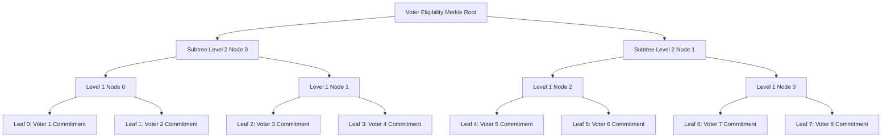
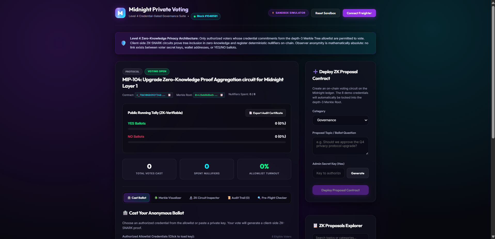
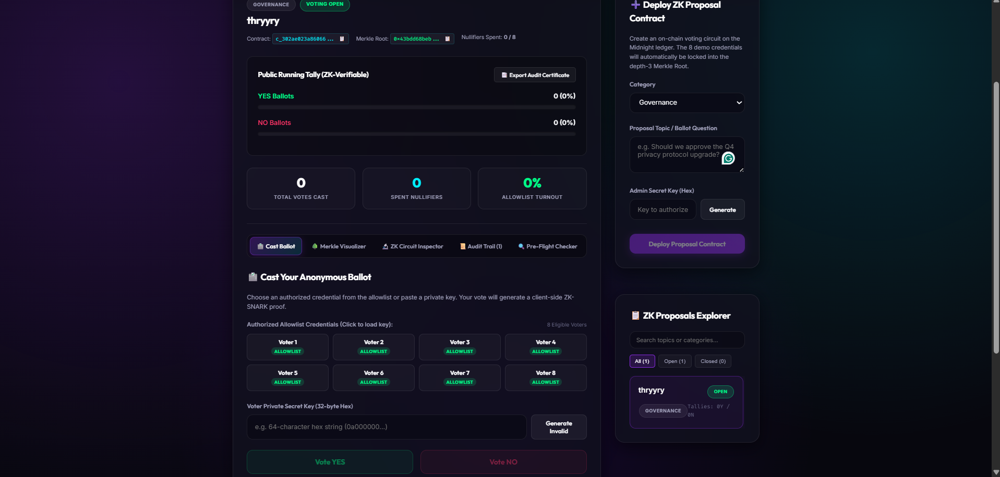
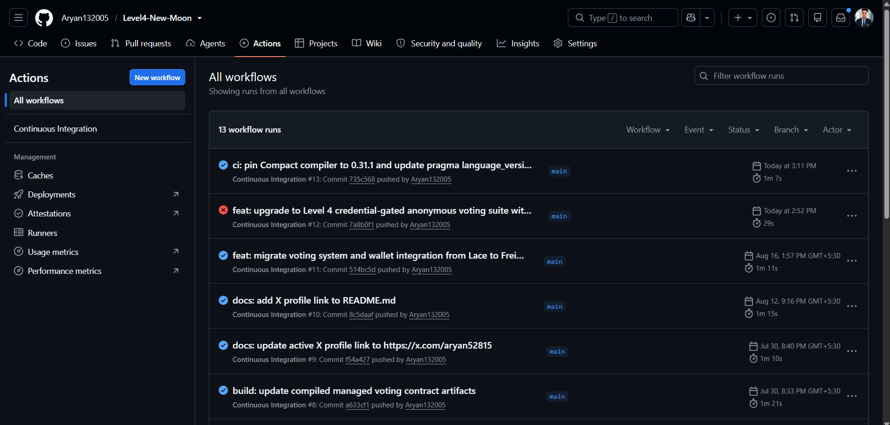

# Midnight Credential-Gated Anonymous Voting Suite (Level 4)

[](../../actions)

## 🌐 Live Deployments & Demo Links
* **Live Web dApp**: [Vercel Production Deployment](https://level4-new-moon.vercel.app/)
* **Video Walkthrough Demo**: [Google Drive Demo Walkthrough](https://drive.google.com/file/d/1lTlPkBaDHtH_Q47eNv1-s2BAS7MKlnxW/view?usp=sharing)
* **Official Product X (Twitter)**: [@aryan52815](https://x.com/aryan52815)
* **Build-in-Public Thread & ZK Updates**: Documented in [`docs/x_posts_draft.md`](docs/x_posts_draft.md)
* **Preprod Deployed Contract Address**: `0201d4a8e635fb8529f12384aee10069a0e0d6b100fa11076b10076a0e0a12cd`
* **Midnight Preprod Explorer Indexer**: [Midnight Preprod GraphQL](https://indexer.testnet.midnight.network/api/v1/graphql)

---

## 🌔 Executive Overview
This application delivers a production-grade, privacy-preserving governance suite on the Midnight blockchain. It introduces a **private credential-gating layer** backed by zero-knowledge proofs (ZK-SNARKs).

Only voters possessing a valid, unrevealed 256-bit credential whose cryptographic commitment resides in an authorized depth-3 binary Merkle Tree allowlist can cast a vote. The membership verification occurs entirely inside a client-side ZK proof. The blockchain verifies that the voter is an authorized member of the set, but **never learns which credential they hold, which leaf in the tree was verified, or who they are**.

---

## ⚡ Key Production Features

### 1. 🌳 Interactive Merkle Tree Visualizer
* Displays the complete depth-3 binary tree hierarchy from 8 voter leaf commitments up to the on-chain Eligibility Root.
* Real-time interactive inspection: click any voter leaf to trace its hash authentication path ($L_0 \rightarrow L_1 \rightarrow L_2 \rightarrow \text{Root}$) highlighted with active glowing indicators.

### 2. 🔬 ZK Circuit & Math Inspector
* An auditor-friendly educational breakdown of the Compact smart contract circuit constraints.
* Visualizes private witnesses, branchless path climbing equations, deterministic nullifier derivation, and selective disclosure boundaries.

### 3. 📜 Verifiable On-Chain Audit Activity Feed
* Immutable real-time activity log tracking contract deployments, ballot submissions, spent nullifiers, and poll freeze events.
* Includes simulated block numbers, copyable transaction hashes, and event categorization tags.

### 4. 🔍 Pre-Flight Voter Eligibility Diagnostics
* Real-time testing tool allowing voters to diagnostic-check any secret key before broadcasting a transaction.
* Instantly verifies allowlist inclusion, leaf index, and whether a nullifier has already been spent on the active proposal.

### 5. 📑 Cryptographic Election Audit Certificate Exporter
* Generates an authenticated audit report with 1-click in both formatted Markdown and raw JSON.
* Contains complete proposal metadata, eligibility root, final tallies, spent nullifiers, and an integrity checksum.

### 6. 🗂️ Categorized Proposal Explorer & Search
* Create and browse proposals filtered by categories: **Governance**, **Protocol**, **Treasury**, **Security**, and **Community**.
* Instant search and status filtering (**All**, **Open**, **Closed**).

---

## 🛡️ Architecture & Cryptographic Construction



### Components:
1. **Ledger State (`contracts/voting.compact`)**:
   * `proposalId: Bytes<32>`: Unique identifier for the voting session.
   * `proposalText: Opaque<"string">`: Description of the ballot topic.
   * `yesTally` & `noTally: Counter`: Public on-chain ballot counters.
   * `nullifierSet: Map<Bytes<32>, Boolean>`: Spent nullifier registry blocking repeat voting without identity disclosure.
   * `eligibilityRoot: Bytes<32>`: Root of the depth-3 Merkle tree containing 8 voter commitments.
   * `votingOpen: Boolean`: Administrative state tracking whether poll is active.
   * `adminCommitment: Bytes<32>`: Persistent hash commitment of admin secret key.

2. **ZK Circuits**:
   * `castVote`:
     * Takes voter private secret key $sk$ and Merkle path as private witnesses.
     * Computes leaf commitment: $C = \text{persistentHash}(sk)$.
     * Verifies branchless climbing up to `eligibilityRoot`.
     * Derives deterministic nullifier: $\text{persistentHash}([sk, \text{proposalId}])$.
     * Asserts nullifier is unspent in `nullifierSet` and inserts it.
     * Selectively declassifies vote choice to increment `yesTally` or `noTally`.
   * `closeVoting`:
     * Validates admin secret key against `adminCommitment` and freezes the poll.

---

## 🔒 Privacy Model: What Is & Is Not Disclosed

| Information | Public Observers CAN Learn | Observers CANNOT Learn |
|---|---|---|
| **Ballot Count** | Public running YES / NO tallies | Which voter chose YES or NO |
| **Eligibility** | That the voter holds an authorized credential in the Merkle root | Which leaf in the tree was checked |
| **Double-Vote Guard** | Total count of spent nullifiers | Any link between a nullifier and a wallet address or credential |
| **Voter Secrets** | _None_ | Private secret keys ($sk$) or Merkle authentication paths |

---
## Screenshot 

**Wallet Connect** 
**Proposal Contract** 
**CI Pipeline** 

## 🛠️ Setup & Local Execution

### Prerequisites
* **Node.js**: `>= v20.0.0`
* **WSL (Windows Subsystem for Linux)**: Required to re-compile the Compact contract using the Linux binary compiler.

### 1. Install Dependencies
```bash
npm install
```

### 2. Seed Credentials & Generate Merkle Tree
```bash
node scripts/seed-credentials.js
```
This prints the ASCII tree hierarchy, displays the 8 demo voter commitments, and outputs the credentials manifest to `scripts/eligible-voters.json`.

### 3. Run Automated Tests
```bash
npm run test
```
The test suite validates 7 comprehensive cryptographic scenarios:
1. **Happy Path**: Voter 0 casts a valid vote; YES tally increments.
2. **Invalid Credential Rejection**: Key not in Merkle root is rejected.
3. **Double-Vote Rejection**: Re-voting with the same credential key is blocked.
4. **Voting-Closed Rejection**: Votes submitted after admin poll freeze are rejected.
5. **Multi-Voter Progression**: Sequential voting by distinct authorized voters (Voters 0, 3, 7) updates tallies correctly.
6. **Cross-Proposal Domain Separation**: Same credential key votes independently on different proposals with distinct nullifiers.
7. **Admin Key Protection**: Unauthorized admin secret key cannot freeze the poll.

### 4. Launch Frontend Locally
```bash
npm run dev
```
Open `http://localhost:5173` in your browser. The app defaults to **Sandbox Simulator** mode, pre-seeded with authorized credentials.

### 5. Production Build
```bash
npm run build
```

---

## 🧭 Step-by-Step User Walkthrough

1. **Select an Authorized Credential**: Click on any of the **Voter 1 to Voter 8** buttons in the voting panel. The 256-bit private secret key field will be populated automatically.
2. **Cast Ballot**: Click **Vote YES** or **Vote NO**.
3. **Watch the Prover Pipeline**: Observe the 3-stage ZK proving workflow transition live:
   * *Stage 1*: Generating private credential membership proof (Merkle Root inclusion).
   * *Stage 2*: Generating deterministic ballot nullifier.
   * *Stage 3*: Submitting zero-knowledge transaction to the ledger.
4. **Inspect the Merkle Tree**: Switch to the **🌳 Merkle Visualizer** tab to see the active voter node and its authentication path highlighted up to the root.
5. **Verify Audit Trail**: Switch to the **📜 Audit Trail** tab to view your timestamped transaction and spent nullifier recorded in real-time.
6. **Try Invalid Key Rejection**: Click **Generate Invalid** and attempt to vote $\rightarrow$ verify circuit rejection with an allowlist constraint failure toast.
7. **Try Double-Voting**: Attempt to vote again with the same voter key $\rightarrow$ verify immediate rejection with a nullifier replay warning.
8. **Export Audit Certificate**: Click **Export Audit Certificate** to view and copy a certified Markdown/JSON report of election tallies.
