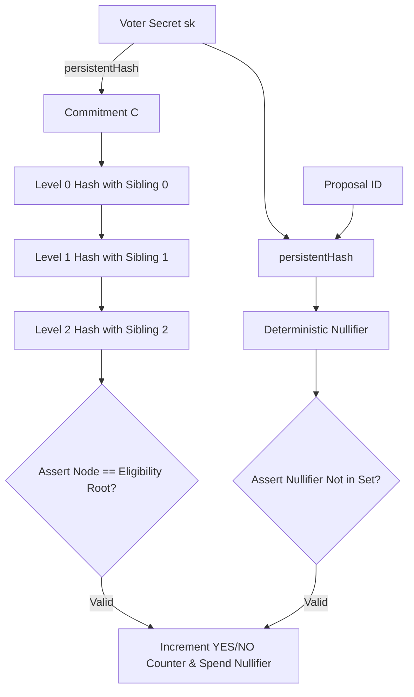

# Cryptographic Credential Model & Privacy Specification

**Document Version**: 2.0 (Level 4 - Waxing Gibbous / New Moon)  
**Protocol**: Midnight Credential-Gated Anonymous Voting Protocol  
**Smart Contract**: [`contracts/voting.compact`](../contracts/voting.compact)

---

## 1. Concrete Credential Model

To eliminate centralized identity providers and avoid linking ballots to public on-chain wallet addresses, this dApp implements a **Private Merkle-Proof of Inclusion in a Pre-Authorized Credential Allowlist**.

### Design Rationale:
1. **Zero External Dependencies**: Does not require interacting with external third-party identity issuers or KYC oracles at voting time.
2. **Strict Client-Side ZK Isolation**: The user's private credential key ($sk$) and the intermediate Merkle authentication path nodes never leave the client's local memory.
3. **Branchless Circuit Execution**: Merkle path climbing is computed using constant-time branchless arithmetic inside the Compact circuit to eliminate microarchitectural side-channels.

---

## 2. Cryptographic Primitives & State Parameters

### 2.1 Private Credential Secret ($sk$)
Each eligible voter holds a unique, high-entropy 256-bit private secret key:
$$sk \in \{0, 1\}^{256}$$

### 2.2 Credential Commitment (Leaf $C$)
The public voter commitment is derived using Midnight's collision-resistant `persistentHash`:
$$C = \text{persistentHash}(sk)$$
The commitment $C$ functions as a one-way leaf in the voter eligibility tree. Knowing $C$ reveals nothing about $sk$.

### 2.3 Eligibility Set Representation (Depth-3 Merkle Tree)
The universe of authorized voters ($N = 8$) is structured as a complete binary Merkle tree of depth 3:
- **Leaves (Level 0)**: $C_0, C_1, C_2, C_3, C_4, C_5, C_6, C_7$
- **Level 1 Nodes**: $N_{1,i} = \text{persistentHash}([C_{2i}, C_{2i+1}])$ for $i \in \{0, 1, 2, 3\}$
- **Level 2 Nodes**: $N_{2,j} = \text{persistentHash}([N_{1,2j}, N_{1,2j+1}])$ for $j \in \{0, 1\}$
- **Level 3 (Eligibility Root)**: $R = \text{persistentHash}([N_{2,0}, N_{2,1}])$

The 32-byte root $R$ is registered on the Midnight public ledger during proposal initialization:
```compact
export ledger eligibilityRoot: Bytes<32>;
```

---

## 3. Zero-Knowledge Proof Construction (`castVote`)

When a voter submits a ballot, their browser generates a zero-knowledge proof satisfying the following constraints:



### 3.1 Private Witnesses Provided to Circuit:
| Witness Input | Type | Visibility | Description |
|---|---|---|---|
| `voterSecretKey()` | `Bytes<32>` | **Private** | The 256-bit credential secret held by the voter |
| `voteChoice()` | `Boolean` | **Private** | The ballot choice (true = YES, false = NO) |
| `merklePath()` | `Vector<3, Bytes<32>>` | **Private** | Sibling node hashes along the path to the root |
| `merkleLeftInputs()` | `Vector<3, Bytes<32>>` | **Private** | Pre-sorted left hash inputs for branchless hashing |
| `merkleRightInputs()` | `Vector<3, Bytes<32>>` | **Private** | Pre-sorted right hash inputs for branchless hashing |

### 3.2 Branchless Verification Equations:
At each level $k \in \{0, 1, 2\}$, where $\text{current}_0 = C$ and $\text{current}_{k+1} = \text{node}_k$:
$$\text{assert}((\text{left}_k == \text{current}_k \land \text{right}_k == \text{path}_k) \lor (\text{left}_k == \text{path}_k \land \text{right}_k == \text{current}_k))$$
$$\text{node}_k = \text{persistentHash}([\text{left}_k, \text{right}_k])$$
At depth 3, the circuit enforces:
$$\text{assert}(\text{node}_2 == \text{eligibilityRoot}, \text{"Voter credential is not in the eligibility set"})$$

---

## 4. Deterministic Nullifier & Double-Vote Guard

To mathematically prevent duplicate voting without revealing voter identity or linking ballots:
$$\text{nullifier} = \text{persistentHash}([sk, \text{proposalId}])$$

### Security Guarantees:
1. **Uniqueness**: Since each authorized voter possesses a distinct $sk$, their derived nullifier is strictly deterministic and unique for a given `proposalId`.
2. **Domain Separation**: Because the nullifier incorporates `proposalId`, the same voter secret key generates completely unrelated nullifiers across different proposals. Voters cannot be tracked or correlated across multiple election sessions.
3. **Anti-Replay Ledger Verification**:
   ```compact
   assert(!nullifierSet.member(nullifier), "Double voting is not allowed");
   nullifierSet.insert(nullifier, true);
   ```
4. **Selective Declassification Boundary**:
   Only `disclose(voteChoice())` and `disclose(nullifier)` are exposed to the ledger. All Merkle path nodes, sibling hashes, leaf commitments, and secret keys remain zero-knowledge private witnesses.

---

## 5. Security & Threat Analysis

| Threat Vector | Mitigation Mechanism | Result |
|---|---|---|
| **Voter Coercion / Ballot Tracing** | ZK-SNARK circuit proves eligibility without disclosing credential index or secret key. | **Prevented** |
| **Double Voting** | Ledger asserts non-membership in `nullifierSet` and inserts spent nullifier in the same transaction. | **Prevented** |
| **Unauthorized Voter Injection** | Cryptographic climb requires matching `eligibilityRoot`. | **Prevented** |
| **Cross-Proposal Linkability** | Nullifiers are domain-separated by hashing with `proposalId`. | **Prevented** |
| **Unauthorized Poll Closure** | Admin must provide private witness $adminSk$ satisfying $\text{persistentHash}(adminSk) == \text{adminCommitment}$. | **Prevented** |
